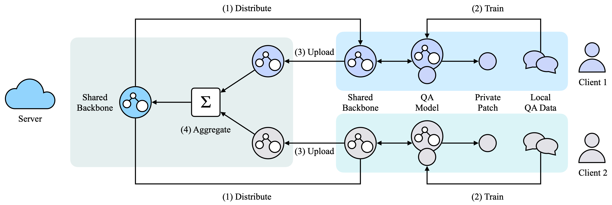

# FedMatch
Repo for our paper, [FedMatch: Federated Learning Over Heterogeneous Question Answering Data](https://arxiv.org/abs/2108.05069), by Jiangui Chen, Ruqing Zhang, Jiafeng Guo, Yixing Fan, Xueqi Cheng.

## Overview



We are excited to present our novel Federated Matching framework for QA, named FedMatch, with a backbone-patch architecture. It could leverage all the available QA data to boost the model training and remove the need to directly exchange the privacy-sensitive QA data among different participants. By decomposing the QA model in each participant into a shared module and a private module, it is able to leverage the common knowledge in different participants and capture the information of the local data in each participant. Empirical results showed that our method can effectively improve the perfor- mance by exploiting the useful information of multiple participants in a privacy-preserving way.

## Setup

- Install python >= 3.6 and pip
- `pip install -r requirements.txt`
- install [PyTorch](https://pytorch.org)

## Download

- [FedQA](https://drive.google.com/file/d/1gwJwRW4PFPufht3ZYk0bUOfblId1eg_m/view?usp=sharing)

## Acknowledgements
- [transformers](https://github.com/huggingface/transformers)
- [simple-effective-text-matching-pytorch](https://github.com/alibaba-edu/simple-effective-text-matching-pytorch)

## Citation
If you find our work useful, please consider citing our paper:

```
@inproceedings{chen2021fedmatch,
  title={FedMatch: Federated Learning Over Heterogeneous Question Answering Data},
  author={Chen, Jiangui and Zhang, Ruqing and Guo, Jiafeng and Fan, Yixing and Cheng, Xueqi},
  booktitle={Proceedings of the 30th ACM International Conference on Information \& Knowledge Management},
  pages={181--190},
  year={2021}
}
```

## License
This project is under Apache License 2.0.
